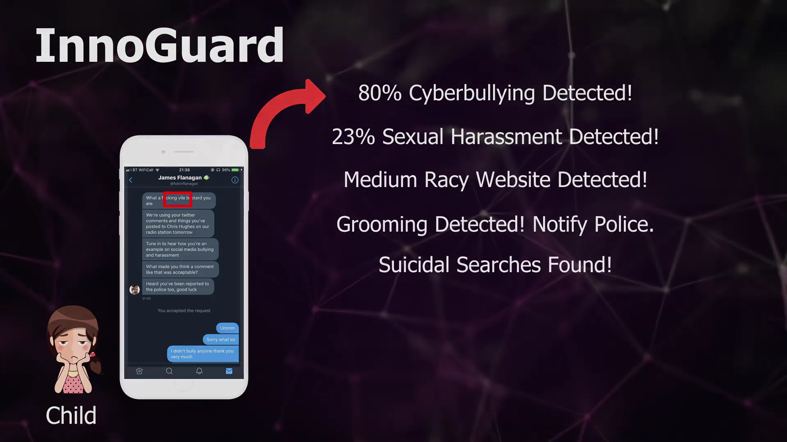
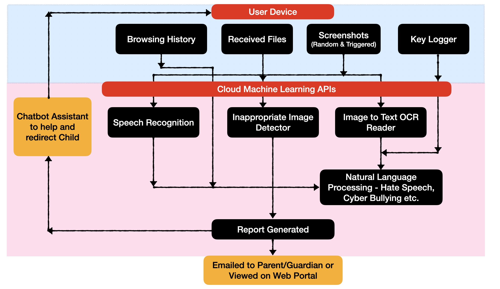
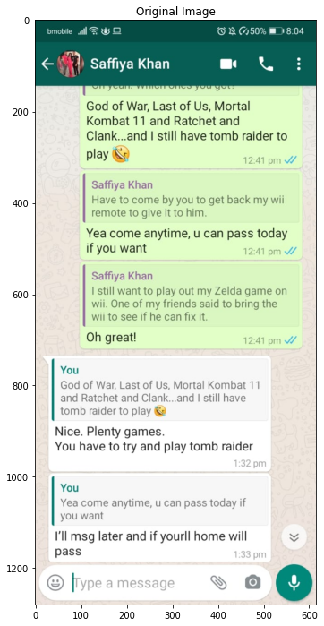
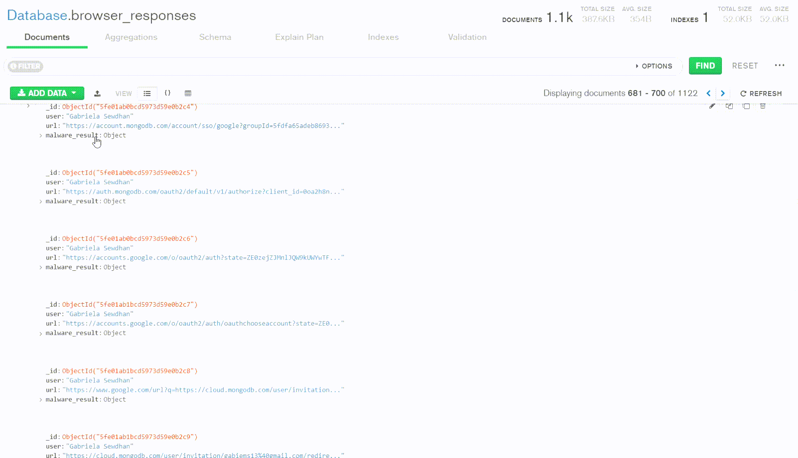
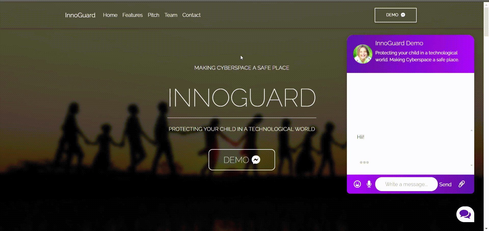

# InnoGuard

**N.B: More details and patches coming soon...**

InnoGuard is a child protection tool that provides protection for children by classifying violence against children through texts and audio, and determining age inappropriate images and links.

[]()

## Table of Contents

- [InnoGuard Tools](#innoguard-tools)
    - [OCR Text Detection and Recognition](#ocr-text-detection-and-recognition)
    - [Safe Browsing](#safe-browsing)
    - [Tisane API](#tisane-api)
    - [Google Vision API](#google-vision-api)
    - [Google Speech API](#google-speech-api)
- [Usage](#usage)
    - [Configuration](#configuration)
    - [OCR Usage](#ocr-usage)
    - [Safe Browsing Usage](#safe-browsing-usage)
    - [Tisane API Usage](#tisane-api-usage)
    - [Google Vision Usage](#google-vision-usage)
    - [Google Speech Usage](#google-speech-usage)
- [Future Work](#future-work)
- [License](#license)
- [Links](#links)

## InnoGuard Tools

InnoGuards Overall Architecture is shown below.
[]()

### OCR Text Detection and Recognition

Extracts text from images through screenshots.

Example WhatsApp Screenshot   |  OCR Text Extraction
:----------------------------:|:-------------------------:
  |  

### Safe Browsing

BrowserHistory Module and SafeBrowsing API are used to extract one’s browsing history from a user's local computer into a csv or pandas array for analysis of age inappropriate links.

The links are stored within a Mongo Database and are determined as **malicious** or not.



### Tisane API

Classifies violence against children [Cyberbulling, Sexual Comments and Harassment, Grooming, Emotional Abuse and Suicidal Tendencies] through texts.

### Google Vision API

Determines child inappropriate images.



### Google Speech API

Allows audio analysis by turning speech to text.

The recorded audio is turned into text and then analysed through Tisane API for violence against children as shown below.


## Usage

### Configuration

#### Requirements

**APIs Installation**: 

- To get your **Google API Key**, [click here.](https://developers.google.com/maps/documentation/maps-static/get-api-key)
- To get your **Tisane API Key**, [create an account by clicking here](https://tisane.ai/signup/)
  - Then go to **API** or **[https://dev.tisane.ai/developer](https://dev.tisane.ai/developer)** to get your primary and secondary Tisane API keys.

**MongoDB Creation**:
To create a Mongo Database, [click here.](https://www.mongodb.com/basics/create-database)

#### Project Installation:

To clone and run this application, you'll need [Git](https://git-scm.com) installed on your computer. From your command line:

```bash
# Clone this repository
git clone https://github.com/InnoGuard/InnoGuard.git

# Go into the repository
cd InnoGuard

# Create new Python virtual environment [Optional]

```
To get the commands to create your virtual environment, [click here.](https://uoa-eresearch.github.io/eresearch-cookbook/recipe/2014/11/26/python-virtual-env/)

```bash
# Upon activating the new virtual environment, at root directory, run
pip3 install -r requirements.txt

```

**Constants.py File**:

```bash

# Create a Constants.py file under the path scripts/libs/ with the content:
GC_API_KEY = 'your_google_api_key_here'
MONGODB = "your_mongodb_address"

# Used for Google Vision API
likelihood_name = ('UNKNOWN', 'VERY_UNLIKELY', 'UNLIKELY', 'POSSIBLE',
                   'LIKELY', 'VERY_LIKELY')


TISANE_API_KEY_1 = 'primary_api_key'
TISANE_API_KEY_2 = 'secondary_api_key'

FILE_PATH = "local path to images and audio, for testing e.g. D:\pythonProjects\InnoGuard\"

```

### OCR Usage

Open in colab - https://colab.research.google.com/gist/rajeevratan84/45ca3d6c74175a204ca644ae1605daa4/ocr-on-screenshots

### Safe Browsing Usage

```bash

# Go to the Scripts Folder
cd scripts

# Execute the following Python script:
python3 getBrowserHistory.py

# Output from these commands will be displayed via the terminal.

```

### Tisane API Usage

Coming soon ...

### Google Vision Usage

```bash

# Attach an image called "test.png" to the root folder

# Go to the Scripts Folder
cd scripts

# Execute the following Python script:
python3 getImageResults.py

# Output from these commands will be displayed via the terminal.

```

### Google Speech Usage

Coming soon ...

## Future Work

The team at InnoGuard plans to implement:

- **Notification and Reporting System**: Upon identification, InnoGuard shall create a report of all instances mentioned above and send this report to the child’s parents or guardian via email or the police if the danger is high, with varying levels (colours) of danger and importance. 

- **Caribbean Lingo Dataset**: Currently, the APIs used to not consider Caribbean Lingo as shown in the gif below where it detects the Caribbean Phrase "Buss ah wine" as a person.
  - Thus, the new model would be emphasized and trained against Caribbean Speech Datasets to detect harmful Caribbean Lingo online.

- **Chatbot Assistant**:  InnoGuard shall provide real-time emotional support via a chatbot to give tips and consolation.

## License

InnoGuard is licensed under the terms of the MIT Open Source license and is available for free.

## Links
* [YouTube Pitch](https://youtu.be/Ncit5I1Bsxo)
* Live Website Link Coming soon ...

